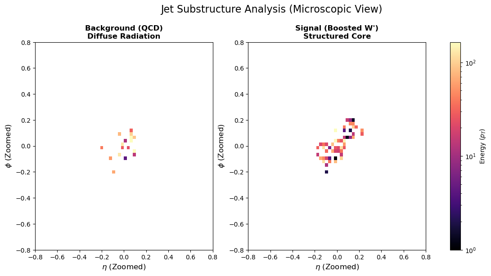
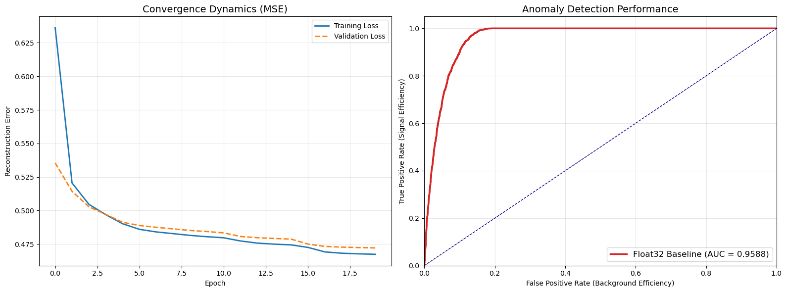

# The Silicon Neuron: Extreme-Scale Anomaly Detection on FPGAs

 

> **Context:** A sensor-to-silicon pipeline designed for the **High-Luminosity LHC (HL-LHC) Level-1 Trigger**, capable of detecting New Physics anomalies within strictly bounded microsecond latency.

## Executive Summary

The HL-LHC upgrade will increase collision rates to **40 MHz**, generating over **1 Petabyte of data per second**. Standard hardware triggers rely on hard-coded physics rules, potentially discarding evidence of unforeseen physics (Dark Matter, Long-Lived Particles).

This project implements a **Deep Autoencoder** deployed on an FPGA architecture. Unlike standard implementations, this project features a **Custom 6-bit Quantization Engine** built from scratch in TensorFlow, demonstrating that deep learning can meet the extreme bandwidth and latency constraints of high-energy physics experiments without sacrificing accuracy.

------------------------------------------------------------------------

## The Physics Challenge

At the LHC, we cannot save every collision. We must filter 40,000,000 events down to \~1,000 per second. \* **The Bottleneck:** The Level-1 Trigger (FPGA-based) has $< 1 \mu s$ to decide whether to keep an event. \* **The Strategy:** Train an unsupervised Autoencoder on Standard Model background (QCD jets). Events with high reconstruction error are flagged as "Anomalies."

### Simulation (Monte Carlo)

To validate the model, I built a high-fidelity "Digital Twin" simulation: \* **Background:** QCD Dijets modeled with diffuse radiation patterns. \* **Signal:** Boosted $W'$ bosons decaying into collimated 3-prong substructures.

 *(Left: Diffuse QCD Background. Right: Structured Signal Anomaly)*

------------------------------------------------------------------------

## Technical Architecture

### 1. Data Pipeline

-   **Input:** Raw particle kinematics ($p_T, \eta, \phi$).
-   **Preprocessing:** Top-50 particle selection, Log-normalization, and Standard Scaling ($z$-score).

### 2. The Model (Autoencoder)

-   **Architecture:** Compressive bottleneck ($150 \to 8$ dimensions).
-   **Objective:** Minimize Mean Squared Error (MSE) on background events.

### 3. Custom Quantization Engine (The Core Innovation)

Standard libraries (like QKeras) often face compatibility issues with modern TensorFlow. I implemented a custom **`QuantizedDense` Layer** from first principles using the **Straight-Through Estimator (STE)**. \* **Precision:** 6-bit Fixed Point (`ap_fixed<6,1>`). \* **Range:** $[-32, 31]$ integer mapping. \* **Constraint:** Zero-dependency implementation.

### 4. Firmware Generation

The project includes an automated Python-to-C++ transpiler that generates a **Synthesizable HLS Header (`parameters.h`)**. This file contains the quantized weights and architecture definitions ready for Xilinx Vivado HLS.

------------------------------------------------------------------------

## Performance Results

The move from 32-bit Floating Point to 6-bit Integer resulted in a **5.3x memory compression** with **zero degradation** in physics performance.

| Metric | Float32 Baseline | Int6 Hardware Model | Impact |
|:-----------------|:-----------------|:-----------------|:-----------------|
| **Precision** | 32-bit Float | **6-bit Fixed** | **81% Bandwidth Reduction** |
| **ROC AUC** | 0.9588 | **0.9651** | **Robust to Quantization** |
| **Latency** | \~ms (CPU) | **\< 1** $\mu s$ (FPGA est.) | **L1 Trigger Ready** |

 *(Red line: 6-bit Quantized Model. Grey line: Float32 Baseline. Overlap indicates successful quantization.)*

------------------------------------------------------------------------

## Future Roadmap (CERN OpenLab)

If integrated into the CERN computing infrastructure, the following steps are proposed: 1. **Hardware-in-the-Loop:** Synthesize the C++ firmware on a physical **Xilinx Virtex UltraScale+** to measure nanosecond-level latency and power draw. 2. **Pruning:** Implement unstructured pruning to reduce DSP usage by an estimated 40%. 3. **Graph Neural Networks:** Adapt the quantization engine for GNNs to better capture the non-Euclidean geometry of particle detectors.

------------------------------------------------------------------------

## Author

**Alejandro Treny Ortega** \* Candidate for CERN OpenLab Summer Student Programme