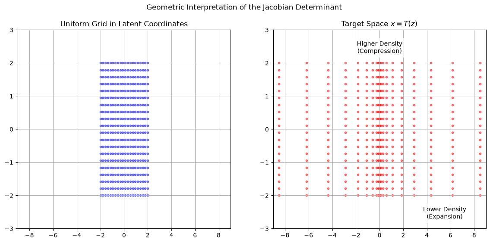
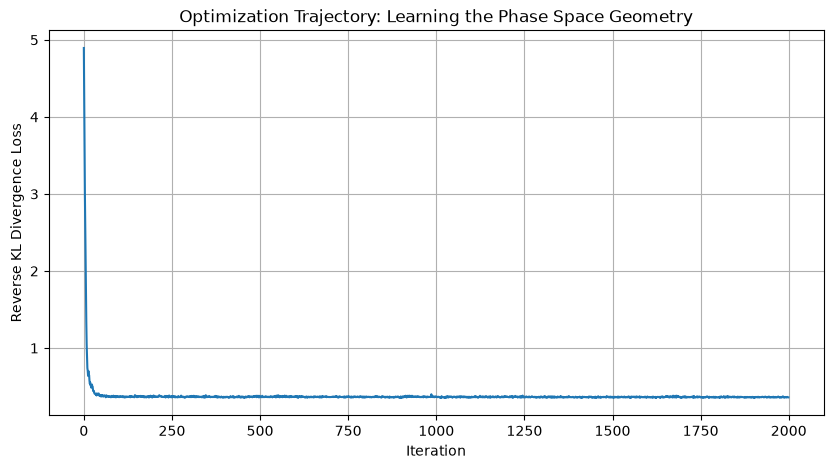

# Accelerating Phase Space Integration via Bijective Normalizing Flows

   

> **Context:** A research prototype for **Neural Importance Sampling**. It demonstrates a normalizing-flow workflow but is not yet a validated phase-space integrator.

## 1. The Physics Challenge: Simulation Efficiency

Particle physics event generation is dominated by the evaluation of scattering cross-sections, represented as high-dimensional integrals of complex matrix elements: $I = \int_{\Omega} f(x) \, dx$. This project explores normalizing flows as proposals for importance sampling. A flow can evaluate its own density exactly, but an integral estimate is valid only when the target density, proposal density, weights, sampling domain and uncertainty calculation are all verified together.

## 2. Mathematical Framework

The project uses **Diffeomorphic Mappings** $T: z \to x$ to track the proposal density through a Jacobian determinant. This mathematical property alone does not establish estimator accuracy.

### 2.1 The Change of Variables Theorem

By utilizing invertible transformations, the exact probability density $q(x)$ of the neural proposal distribution is evaluated via the Jacobian determinant. This determinant quantifies the local volume distortion required to map a simple Gaussian to a complex physics resonance.

### 2.2 Architecture: RealNVP

The model utilizes the **Real Non-Volume Preserving (RealNVP)** architecture. By employing **Affine Coupling Layers**, the Jacobian matrix is restricted to a triangular form, reducing the computational complexity of the determinant calculation to $O(D)$.

-   **Numerical checks:** Forward/inverse consistency, finite log densities, support of the proposal and independent integral evaluation. Affine log-scales are bounded to prevent overflow.

## 3. Methodology: Overcoming Mode Collapse

A significant challenge in high-dimensional integration is **Mode Collapse**, where narrow resonances are ignored in favor of broad backgrounds.

The notebook first demonstrates reverse-KL fitting, then uses an independent uniform discovery sample and maximum-likelihood fitting to a balanced discovery subset. This balancing changes the proposal; importance weights must use the fitted proposal density rather than assume it matches the target. The final proposal mixes 80% flow draws with 20% uniform draws over the integration box, ensuring positive proposal density throughout that box.

## 4. Validation status

All final comparisons target the same domain, $[-5,5]^4$. Its analytically computed Gaussian-mixture mass is **0.938437**, not 1. Five independent evaluation seeds, each with 100,000 draws from a fixed trained proposal, give estimates **0.937072, 0.934995, 0.949572, 0.940622 and 0.941513**. Their approximate 95% interval half-widths range from **0.010090 to 0.010742**; the notebook prints each estimate, interval and effective sample size. One interval misses the exact value, which is possible at nominal 95% coverage.

The reported variance comparison excludes discovery and training costs. It is not a measured end-to-end speedup or validation on physical matrix elements. The occupancy diagnostic compares identical radius tests on proposal and independent target draws; radius membership is not mixture-component membership.

## 5. Deployment & CERN Proposal

If selected for a student position at CERN, I propose to integrate these Bijective Flows into the **VegasFlow** framework to optimize real Standard Model matrix elements, providing a scalable path toward sustainable event generation for the HL-LHC.

------------------------------------------------------------------------

**Author:** Alejandro Treny

## Reproduction

Use the shared [Python environment](../../RUNNING.md), then execute [notebook.ipynb](notebook.ipynb) from this folder. All targets and samples are generated in the notebook.
