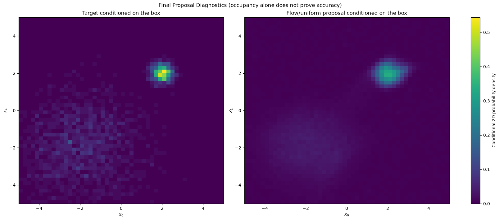

# Accelerating Phase Space Integration via Bijective Normalizing Flows

   

> **Context:** A research prototype for **Neural Importance Sampling**. It demonstrates a normalizing-flow workflow but is not yet a validated phase-space integrator.

## 1. The Physics Challenge: Simulation Efficiency

Particle physics event generation is dominated by the evaluation of scattering cross-sections, represented as high-dimensional integrals of complex matrix elements: $I = \int_{\Omega} f(x) \, dx$. This project explores normalizing flows as proposals for importance sampling. A flow can evaluate its own density exactly, but an integral estimate is valid only when the target density, proposal density, weights, sampling domain and uncertainty calculation are all verified together.

## 2. Mathematical Framework

The project uses **Diffeomorphic Mappings** $T: z \to x$ to track the proposal density through a Jacobian determinant. This mathematical property alone does not establish estimator accuracy.

### 2.1 The Change of Variables Theorem

By utilizing invertible transformations, the exact probability density $q(x)$ of the neural proposal distribution is evaluated via the Jacobian determinant. This determinant quantifies the local volume distortion required to map a simple Gaussian to a complex physics resonance.

### 2.2 Architecture: RealNVP

The model utilizes the **Real Non-Volume Preserving (RealNVP)** architecture. By employing **Affine Coupling Layers**, the Jacobian matrix is restricted to a triangular form, reducing the computational complexity of the determinant calculation to $O(D)$.

-   **Invertibility unit test:** Verified with a reconstruction error of $\epsilon \approx 10^{-7}$.

## 3. Methodology: Overcoming Mode Collapse

A significant challenge in high-dimensional integration is **Mode Collapse**, where narrow resonances are ignored in favor of broad backgrounds.

To ensure full coverage, we implemented a **Global Discovery Phase** using large-scale uniform anchoring. The model was then trained using **Maximum Likelihood Estimation (MLE)** on a stratified dataset, successfully bridging the high-dimensional vacuum between disconnected physics modes.

## 4. Validation status

The numerical outputs and figures are retained as exploratory artifacts. They do not currently establish accuracy or variance reduction: the notebook's quoted final estimate is inconsistent with the known normalization used by the example. Before reporting a result, rerun independent uniform and flow-proposal estimators with the same target, explicit normalized importance weights, a known-integral test, repeated seeds, confidence intervals and a held-out mode-coverage diagnostic.

## 5. Deployment & CERN Proposal

If selected for a student position at CERN, I propose to integrate these Bijective Flows into the **VegasFlow** framework to optimize real Standard Model matrix elements, providing a scalable path toward sustainable event generation for the HL-LHC.

------------------------------------------------------------------------

**Author:** Alejandro Treny
