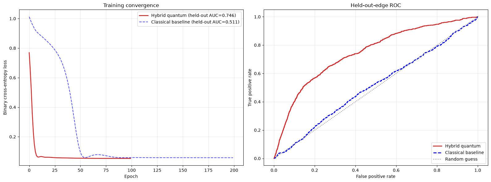

# Hybrid Quantum Graph Neural Networks for Particle Tracking

  

## 1. Project Context: The HL-LHC Data Challenge

The High-Luminosity Large Hadron Collider (HL-LHC) will operate with an average pile-up of $<\mu> \approx 200$, generating approximately 10,000 charged particles per bunch crossing. This density creates a combinatorial explosion in trajectory reconstruction, where traditional algorithms like the Kalman Filter scale quadratically or worse.

This project explores **Quantum Machine Learning (QML)** with a hybrid quantum-classical edge classifier. It is a small-scale simulation experiment, not evidence that QML improves particle tracking.

## 2. Methodology

### 2.1 Dataset and Preprocessing

We utilize the **TrackML Particle Tracking Challenge** dataset (Event 1000). To map the problem to a scale suitable for Quantum Simulation (NISQ era), we apply **Geometric Sectorization**:

-   **Region of Interest:** Central Barrel ($|z| < 400$ mm).
-   **Azimuthal Slice:** First Octant ($0 < \phi < \pi/4$).
-   **Physics cut:** Candidate construction uses only detector-hit geometry; simulated particle kinematics are not used as model features.

### 2.2 Graph Construction

The raw point cloud is converted into a directed graph $G=(V, E)$ based on physical constraints:

-   **Nodes (**$V$): Detector hits with features $(r, \phi, z)$.
-   **Edges (**$E$): Constructed between hits that satisfy momentum conservation and vertex compatibility (e.g., $\Delta \phi / \Delta r < 0.0006$).
-   **Graph Statistics:** The resulting graphs typically contain \~800 nodes and \~10,000 edges with a signal purity of \~11%.

### 2.3 Hybrid Architecture

The model is an experimental **edge-pair classifier** that integrates a
Variational Quantum Circuit (VQC). It does not yet implement message passing,
so it is not presented as a graph neural network benchmark.

1.  **Classical Encoder:** Projects geometric features into a latent space.
2.  **Quantum Kernel:** A 4-qubit parameterized circuit using `StronglyEntanglingLayers` to capture non-linear correlations.
3.  **Optimization:** Implements **Batch Normalization** to stabilize quantum gradients and a **Multi-Qubit Readout** strategy to mitigate the information bottleneck.

## 3. Results

The notebook trains a classical edge classifier and a hybrid quantum edge
classifier on one TrackML event. It now reports an edge-level held-out split,
which prevents scoring the exact optimized edges but is still not an
event-level generalisation metric.

| Architecture | Status |
|:-----------------------|:-----------------------|
| Classical edge classifier | Exploratory, held-out edges from one event |
| Hybrid quantum edge classifier | Exploratory, held-out edges from one event |

 *(Left: Binary Cross Entropy Loss. Right: Receiver Operating Characteristic comparing Quantum vs Classical performance)*

### Key Findings

1.  **Scope:** Held-out edges within one event can share nodes and local
    geometry with training edges, so their AUC is not a tracking performance metric.
2.  **Next validation:** Split by independent events and reserve simulation
    truth exclusively for labels.

## 4. Installation and Usage

### Prerequisites

-   Python 3.10+
-   PyTorch & PyTorch Geometric
-   PennyLane (Quantum Simulator)
-   Pandas, NumPy, Matplotlib

### Execution

1.  Clone the repository.
2.  Ensure the `train_100_events` folder is present in the root directory. You can download the `train_sample.zip` from Kaggle: [TrackML Dataset](https://www.kaggle.com/c/trackml-particle-tracking-challenge/data).
3.  Run the Jupyter Notebook `notebook.ipynb`.
    -   **Step 1:** Loads and sectorizes the TrackML data.
    -   **Step 2:** Constructs the geometric graph.
    -   **Step 3:** Trains the Classical Benchmark.
    -   **Step 4-5:** Trains the Hybrid Quantum Model and compares results.

## 5. Future Roadmap

To achieve quantum advantage in future iterations:

-   **High-Dimensional Encoding:** Implement Amplitude Embedding to encode $2^N$ features into $N$ qubits.
-   **Hardware Deployment:** Port inference to IBM Q or IonQ hardware to test noise resilience.
-   **Equivariant Ansatz:** Design quantum circuits that inherently respect the cylindrical symmetry of the detector.

---

**Author:** Alejandro Treny 
